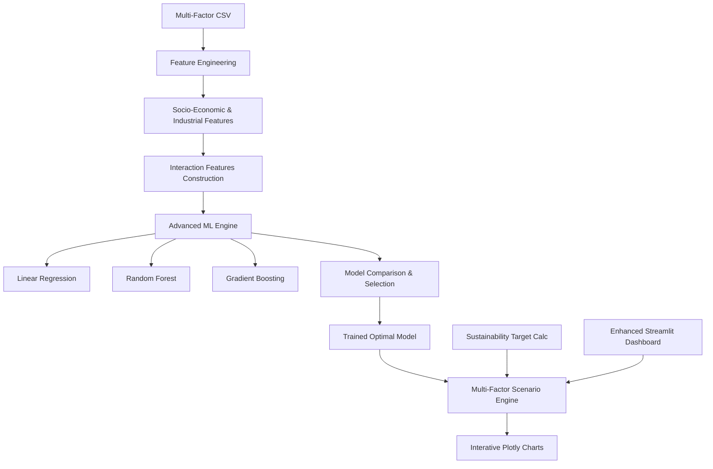

# System Architecture (v2.0)
## Research-Grade Carbon Emission Forecasting System

---

## 🏗️ HIGH-LEVEL ARCHITECTURE

The system follows a modular, layer-based architecture designed for flexibility and depth.

---

## 📊 DATA PIPELINE

### 1. Multi-Source Integration
The system ingests a wide array of factors:
- **Policy Inputs**: Renewable %, Fossil %, Industrial Growth.
- **Structural Inputs**: Population, Urbanization, Forest Cover.
- **Industrial Inputs**: Energy Demand, Transport Index, Production Index.

### 2. Feature Engineering Layer
- **Interpolation**: Handles missing data using linear interpolation and ffill/bfill.
- **Interaction Construction**:
  - `Energy Intensity` = Energy Demand / Population
  - `Fossil Dependency` = Fossil % × Industrial Production
  - `Renewable Penetration` = Renewable % × Energy Demand
- **Scaling**: Uses `StandardScaler` to normalize features for ML training.

---

## 🧠 ML ENGINE & FORECASTING

### Algorithm Selection
The system automatically evaluates three distinct mathematical approaches:
1. **Multiple Linear Regression**: For capturing directional trends.
2. **Random Forest**: For modeling complex non-linear relationships and high-dimensional interactions.
3. **Gradient Boosting**: For high-precision prediction on longitudinal data.

### Feature Importance Analysis
Using Gini importance (for RF/GBM) or normalized coefficients (for LR), the system identifies the "Emission Drivers," providing transparency into the forecast logic.

---

## 🎯 SIMULATION LOGIC

### 1. Structural Baseline Projection
Structural factors are projected into the future based on historical compound growth rates ($CGR$) before any policies are applied:
$$Value_{t+n} = Value_t \times (1 + growth\_rate)^n$$

### 2. Policy-Driven Adjustment
Controllable policy sliders modify the baseline projections progressively:
- **Progressive Impact**: Policies take time to implement. Impact increases by a compound factor annually after the `start_year`.
- **Residual Floor**: The system strictly enforces a non-zero floor (~10% of current baseline) to account for essential human activities that cannot currently be eliminated from the carbon cycle.

---

## 🌳 SUSTAINABILITY TARGETS

### Computation Models
1. **Historical Baseline**: Targets a safe level based on a specific historical year (e.g., 1990 level).
2. **Percentage Reduction**: Targets a specific % reduction from a reference year (e.g., 50% below 2005 levels).
3. **Net-Zero Pathway**: Targets the residual emission floor with exponential decay.

### Convergence Logic
The "Healthy Target" line indicates the destination, while the "Sustainable Pathway" uses exponential decay to show a realistic curve toward that destination:
$$Emission_{t} = Emission_{start} \times e^{-k \Delta t}$$
Where $k$ is the decay rate required to reach the target by the target year.

---

## 🛠️ COMPONENT BREAKDOWN

### `core/feature_engineering.py`
- Handles data loading, cleaning, and complex feature construction.
- Projects the "Silent" structural trends.

### `core/model_training.py`
- The model persistence and training layer.
- Handles multi-algorithm comparison.

### `core/scenario_engine.py`
- The simulation brain that combines human policy with natural/social trends.

### `core/sustainability_target.py`
- The policy goal calculator that defines what "Healthy" looks like.

---

## 🚀 EXTENSIBILITY POINTS

- **New Factors**: Add any variable to the CSV and it will be picked up by the `FeatureEngineer`.
- **New Models**: Plug in any scikit-learn compatible regressor into `MultiFactorEmissionModel`.
- **API Ready**: All core logic returns `pandas` DataFrames or `dictionaries`, making it native-ready for JSON serialization via FastAPI.
